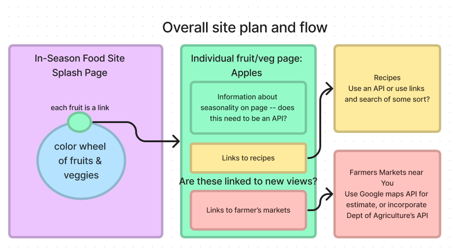

# In-Season Food Finder -- Work in Progress, title pending

### A site that helps users find information about when fruits and vegetables are in season, recipes using selected fruits and vegetables, and where to find local farmers markets. 

### By: Sarah Andyshak

#### [Known Bugs](#known-bugs)
#### [License](#license)
#### [Research Points](#research-points)
##### • [Project specific](#project-specific)
##### • [Future research](#future-research-or-if-time-today)
#### [Research Log](#research-and-planning-log)

### Known Bugs:

### License:
Enjoy the site! If you have questions or suggestions, please contact me!

[MIT](https://github.com/git/git-scm.com/blob/main/MIT-LICENSE.txt)

Copyright (c) 2023 Sarah Andyshak

#### Friday, 28 April 2023
* Key issue to resolve today: write in C# or React; or both. 

## Research points:
* How do C# and React work together
* Is one better than the other for this project
* APIs and React
* Look into Firestorm
* How does navigation work in React
* Is C# or React more used by front end

### Project specific:
* Google maps API or Dept of Agriculture's API for farmer's market locations
* Recipe API or link to recipe sites

## Future research, or if time today: 
* Placement of images of fruits and veggies -- better as one large image, or several smaller
* Linking to pages for each fruit/veggie
* Drop-down menus?

## Research and Planning log
* 8am: set up project, lay out key areas of research
* 8:30am: set up [Figma project for planning](https://www.figma.com/file/ZEGbWcXC5QjQC8gzE0UkQT/In-Season-Food-Capstone?node-id=0%3A1&t=v0GHrqAo6qvnaWos-1)

* 9am: Write capstone proposal.
* 10am: Research integrating C# and React.
* 10:50am: Read ahead about Firestorm and React.