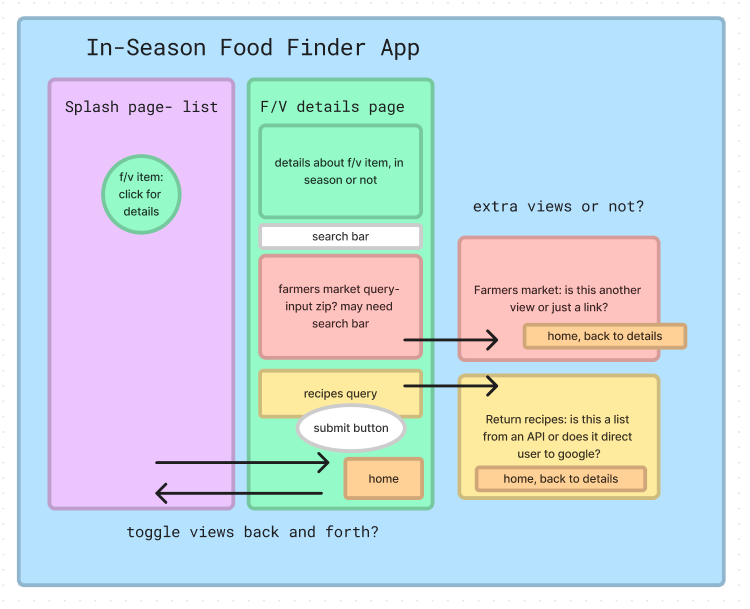

# In-Season Food Finder -- Work in Progress, title pending

#### A site that helps users find information about when fruits and vegetables are in season, recipes using selected fruits and vegetables, and where to find local farmers markets. 

### By: Sarah Andyshak

#### 🍋 [Known Bugs](#known-bugs)
#### 🍒 [License](#license)
#### 🥦 [Research Points](#research-points)
##### • [Project specific](#project-specific)
##### • [Future research](#future-research-or-if-time-today)
#### 🍇 [Research Log](#research-and-planning-log)

### Known Bugs:

### License:
Enjoy the site! If you have questions or suggestions, please contact me!

[MIT](https://github.com/git/git-scm.com/blob/main/MIT-LICENSE.txt)

Copyright (c) 2023 Sarah Andyshak

## Research points:

#### Friday, 28 April 2023
* Key issue to resolve today: write in C# or React; or both. 

- [x] How do C# and React work together -- seems to be based on writing C# APIs
- [x] Is one better than the other for this project -- seems like React will be better
- [x] Look into Firebase, Firestore
- [x] APIs and React
- [x] How does navigation work in React -- separate pages, or just views in the virtual DOM
- [x] Is C# or React more used by front end -- React is far and away used by frontend

### Project specific:
* Google maps API or Dept of Agriculture's API for farmer's market locations
* Recipe API or link to recipe sites

## Future research, or if time today: 
* Placement of images of fruits and veggies -- better as one large image, or several smaller
* Linking to pages for each fruit/veggie
* Drop-down menus?

## Research and Planning log
* 8am: set up project, lay out key areas of research
* 8:30am: set up [Figma project for planning](https://www.figma.com/file/ZEGbWcXC5QjQC8gzE0UkQT/In-Season-Food-Capstone?node-id=0%3A1&t=v0GHrqAo6qvnaWos-1)

* 9am: Write capstone proposal.
* 10am: Research integrating C# and React.
* 10:50am: Read ahead about Firebase, Firestore and React.
* 11:15am: Break from reading to watch [tutorial on React](https://www.youtube.com/watch?v=b9eMGE7QtTk&list=PLWJHBbgEE85zkXzrgQ9fcHdvw4rH4Cx_U&index=4&ab_channel=JavaScriptMastery).
* 2pm: Return to reading ahead about Firebase and React.
* 2:30pm: research APIs for recipes, farmers markets, and seasonality.
* 3:15pm: more reading about Firebase, Firestore, React.
* 4pm: create first version of the React app layout plan.

* 4:15pm: more reading.
* 5pm: finish reading for the day, final commit.

#### Sunday, 30 April 2023
* approx. 3-6pm: select images, clean images, create color wheel.

#### Friday, 5 May 2023
* 8am: review API projects and lessons.
* 8:45am: test USDA API in Postman, look up updating stats.
* 9am: got API key, testing API in Postman gives a 403 Forbidden error, need to ask about this. Update- after researching, contacted the provided email account.
* 9:30am: begin initial setup of React site.
* 11:14am: brainstorming how a C# API would connect.
* 1:30pm: trying to follow object placement tutorial again.
* 2:15pm: begin work on C# API.

#### Friday, 12 May 2023
* 8am: review project so far.
* 9am: update API to disable nullable, add pagination, add CORS policy, and update migrations.
* 10am: research how to create API "contains" or "includes" type queries.
* 11am: update README for API. Need to revisit why images aren't showing up.
* 11:40am: solved issue, cleaned up API README.
* 1pm: working on React seasonal-foods app, getting routing import statements correct, setting up logic in FoodList and FoodDetail.
* 3:30pm: continuing to try to figure out linking images to mapped detail pages. 
* 4:30-6pm: successfully link images to the correct FoodDetail pages. Take time to choose font, begin basic styling before taking next steps.

#### Monday, 15 May 2023
* 1:15pm: Add recipes to Recipes.js page.
* 2:30pm: Attempt to get images to enlarge when hovered over.
* 3:45: Add links from Recipe page back to Details page.
* 4:30pm: Fix App plan image for README, update README in seasonal-food app.

#### Tuesday, 16 May 2023
* 8am: debating how best to spend my time: build out more functions in React, or host C# API. Part of the debate is if I should shift the API onto Firebase.
* 10:30: Finish styling Recipes.js page, being looking at adding USDA Farmers Market API.
* 11:34: Working on adding a SeasonalSearch.js page to list foods by harvest season.
* 1-2:30: Add Seasons pages and routing.
* 2:30-5pm: Find and format additional images, add hover and link functions to more images; check in with other students about issues.

#### Wednesday 17 May 2023
* 8am: fix issue with links on Recipes.js
* 9am: start stretch goal-- looking at USDA farmers market API and how to incorporate it/ reading about hosting.
* 10:50am finish updating READMEs, screenshots.
* to noon: read about hosting options.
* after lunch: read about hosting, work on hosting API to Azure.
* until 3:40pm: set up connection with Azure.